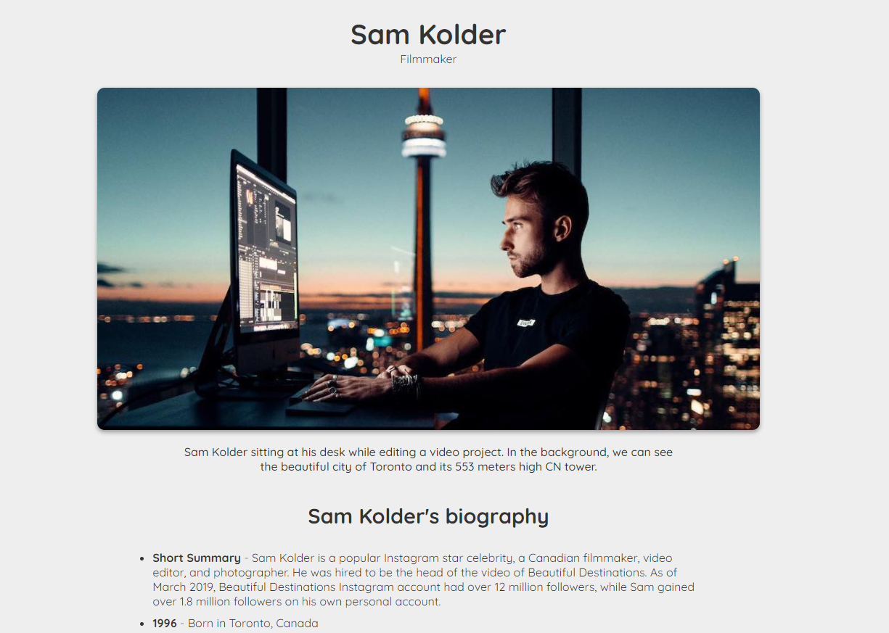

# FreeCodeCamp Challenge - Build a tribute page

## The Challenge

The goal here was to put the learned skills to practice. This challenge was to create a tribute page similar to this: https://codepen.io/freeCodeCamp/full/zNqgVx

### My choice

I decided to go on with this challenge and create a tribute page about a filmmaker that I admire, Sam Kolder.

This is the end result:

### Built with

- Semantic HTML5 markup
- CSS custom properties
- Flexbox

## Author

- Frontend Mentor - [@mitch-webdev](https://www.frontendmentor.io/profile/mitch-webdev)
- GitHub - [mitch-webdev](https://github.com/mitch-webdev)